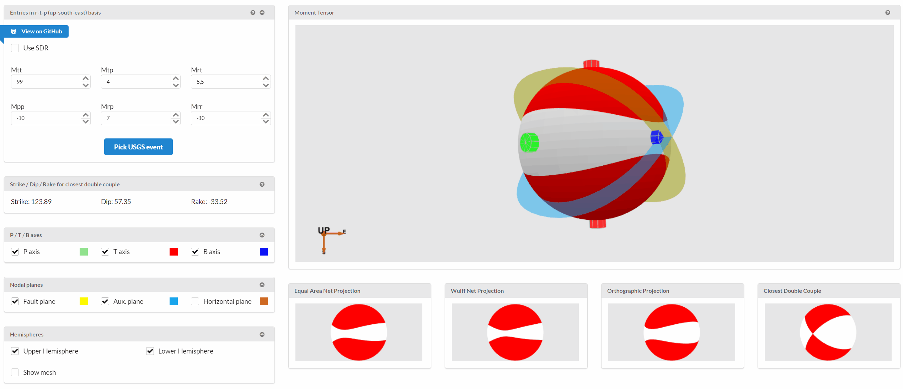

# seismic-beachballs-demo
Repository for demonstrating [seismic-beachballs library](https://github.com/timofeevda/seismic-beachballs) functionality.

This work is based on Carl Tape and Walter Tape work. See http://www.giseis.alaska.edu/input/carl/ for papers and https://github.com/carltape/compearth/tree/master/momenttensor/plot/mma for Mathematica scripts.

Stike/Dip/Rake computation and "closes double couple" view is based on patch_meca.m file in Mirone source code (http://w3.ualg.pt/~jluis/mirone/)

## Demo
See [seismic-beachballs-demo](https://timofeevda.github.io/seismic-beachballs-demo/)

